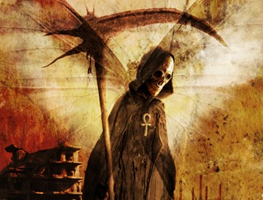

 

Bom, como não podia deixar de comentar sobre meu próprio desafio, seleciono aqui algumas palavras para explanar sobre esse tão temido assunto.

A morte, para alguns é o fim de tudo. Do pó ao pó. Para outros a passagem para o tão temido purgatório à espera do julgamento final. Para alguns a morte é temida, tão temida que evita-se até de comentá-la para não "atrair". Afinal, a morte é a nossa única certeza, eu VOU morrer, você também!

_E para não perder a piada, 'HEI de ver a inscrição cravada em minha lápide: Enfim magro!'_

Entretanto para min, esse assunto é muito esclarecido, sou espírita, talvez não seja a verdade absoluta, mas é o que melhor me convence. A morte é uma passagem, ou transformação. Alguém uma vez fez uma comparação interessante, pensemos em uma lagarta, ela tem sua locomoção limitada, mas um dia ela se prepara para uma grande transformação, se isola em seu casulo e se transforma em uma linda borboleta. Nós estamos aqui, presos em nossas limitações carnais assim como a pobre lagarta, a morte é nossa transformação, que nos liberta e nos ajuda a compreender melhor o sentido de nossa existência. De onde viemos? para onde vamos? Talvez cada um tenha sua teoria, mas é com a morte que todos iremos nos deparar e inevitavelmente sofreremos tal transformação.

Abraços.